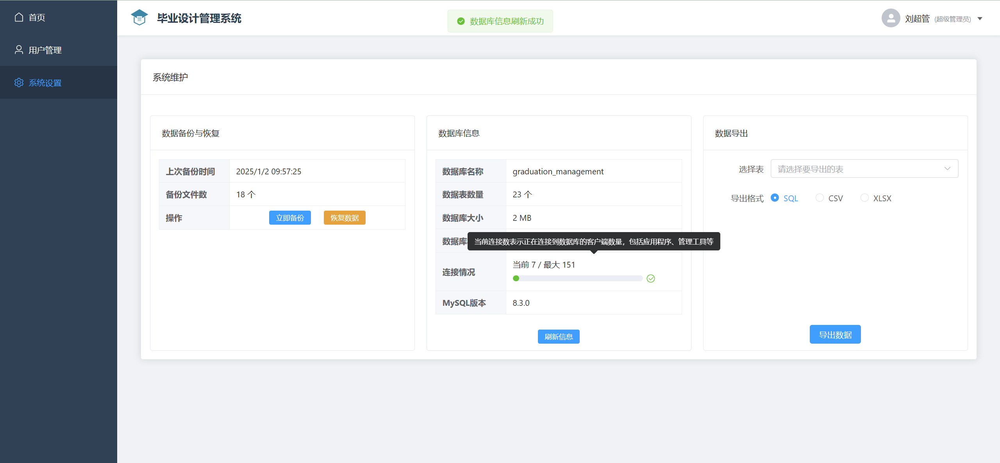
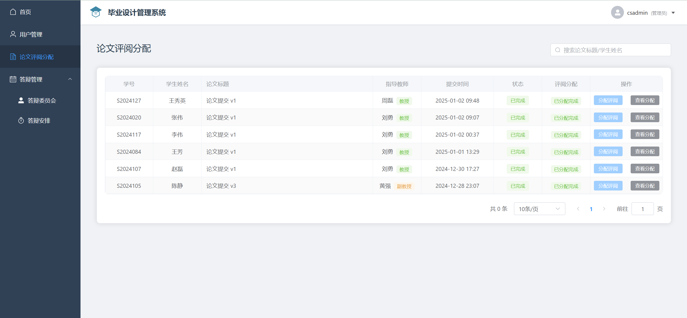
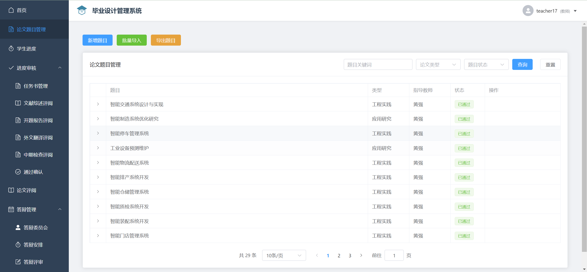
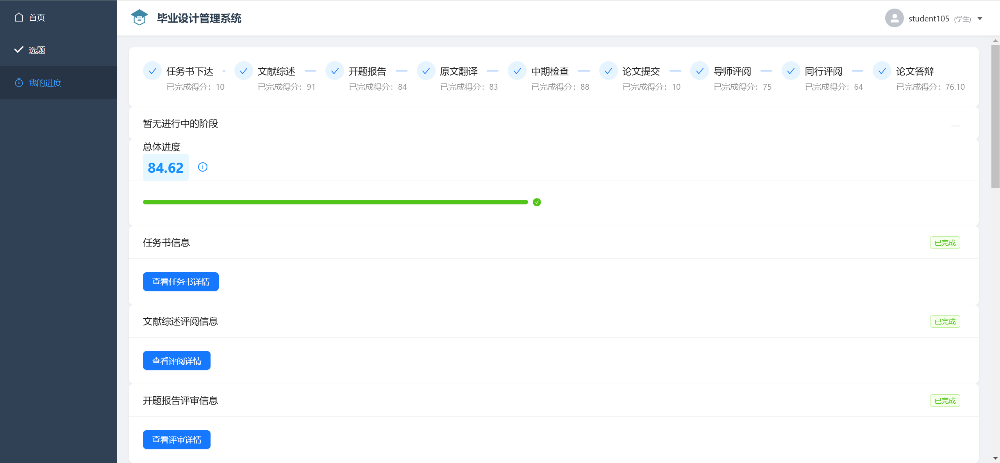
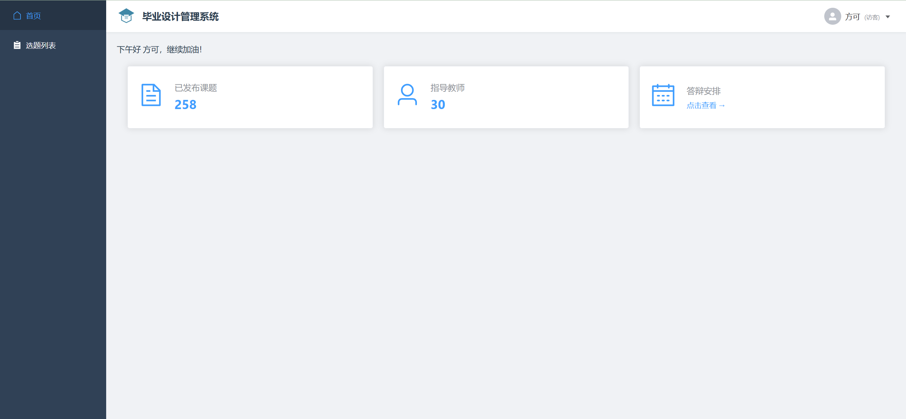

# 毕业设计管理系统

## 项目简介

本系统是一个完整的毕业设计管理平台，用于协助高校管理毕业设计全过程，包括选题、进度管理、论文评审等功能。
（主要是因为数据库课设，最终验收结果为全班唯一一个A+）

## 技术栈

### 前端

- Vue 3
- TypeScript
- Element Plus
- Ant Design Vue
- Vue Router
- Pinia
- Axios

### 后端

- Node.js
- Express
- TypeScript
- MySQL
- JWT认证

## 系统功能

1. 用户管理
   - 多角色支持（教师、学生、管理员、系统管理员、访客）
   - 用户认证与授权
   - 个人信息管理

2. 论文选题
   - 教师发布题目
   - 学生选题
   - 选题审批

3. 进度管理
   - 任务书管理
   - 开题报告
   - 文献综述
   - 外文翻译
   - 中期检查
   - 论文定稿

4. 论文评审
   - 评审分配
   - 评阅打分
   - 评审意见

5. 答辩管理
   - 答辩委员会
   - 答辩安排
   - 答辩评分

## 系统界面展示

### 超级管理员界面



### 管理员界面



### 教师界面



### 学生界面



### 访客界面



### 登录界面


## 项目结构

```bash
├── backend/ # 后端项目目录
│ ├── src/ # 源代码
│ │ ├── controllers/ # 控制器
│ │ ├── middleware/ # 中间件
│ │ ├── routes/ # 路由
│ │ └── utils/ # 工具函数
│ └── uploads/ # 文件上传目录
├── frontend/ # 前端项目目录
│ ├── src/ # 源代码
│ │ ├── api/ # API接口
│ │ ├── components/ # 组件
│ │ ├── views/ # 页面
│ │ ├── router/ # 路由配置
│ │ └── stores/ # 状态管理
```

## 环境要求

- Node.js >= 18.x
- MySQL >= 8.0
- npm >= 9.x

## 安装部署

1. 克隆项目

```bash
git clone [项目地址]
```

2. 后端配置

```bash
cd backend
npm install
```

3. 前端配置

```bash
cd frontend
npm install
npm run dev
```

4. 数据库配置

- 创建数据库
- 导入 schema.sql
- 配置 .env 文件中的数据库连接信息
.env文件需要在backend文件夹下创建，内容如下

```bash
DB_HOST=localhost
DB_USER=root
DB_PASSWORD=你的密码
DB_NAME=graduation_management
PORT=3001
NODE_ENV=development
JWT_SECRET=你的密钥
JWT_EXPIRES_IN=24h
BACKUP_DIR=./backups
```

## 开发环境

- 后端服务：<http://localhost:3001>
- 前端服务：<http://localhost:3000>

## 测试

### 前端单元测试

```bash
cd frontend
npm run test:unit
```

### 前端E2E测试

```bash
npm run test:e2e
```

## 构建部署

```bash

### 后端构建
cd backend
npm run build
```

### 前端构建

```bash
cd frontend
npm run build
```

## 主要依赖版本

### 前端

- vue: ^3.5.13
- vue-router: ^4.5.0
- pinia: ^2.3.0
- element-plus: ^2.9.0
- ant-design-vue: ^4.2.6

### 后端

- express: ^4.18.2
- mysql2: ^3.11.5
- jsonwebtoken: ^9.0.0
- multer: ^1.4.5-lts.1

## 开发团队

BUCT 2022 计科2203 于豪杰

## 注意事项

1. 确保 MySQL 服务正常运行
2. 注意文件上传大小限制（当前限制为10MB）
3. 确保上传目录具有正确的写入权限
4. 生产环境部署时注意修改相关配置
